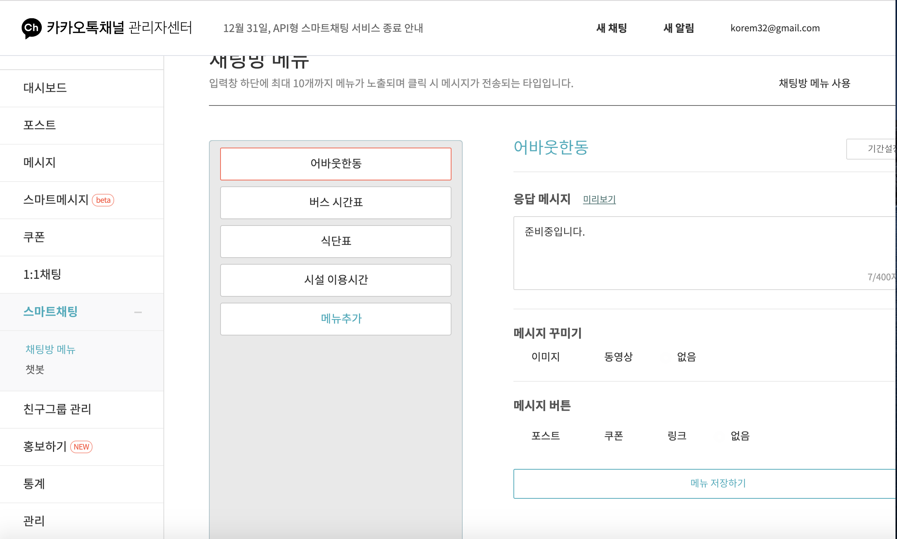
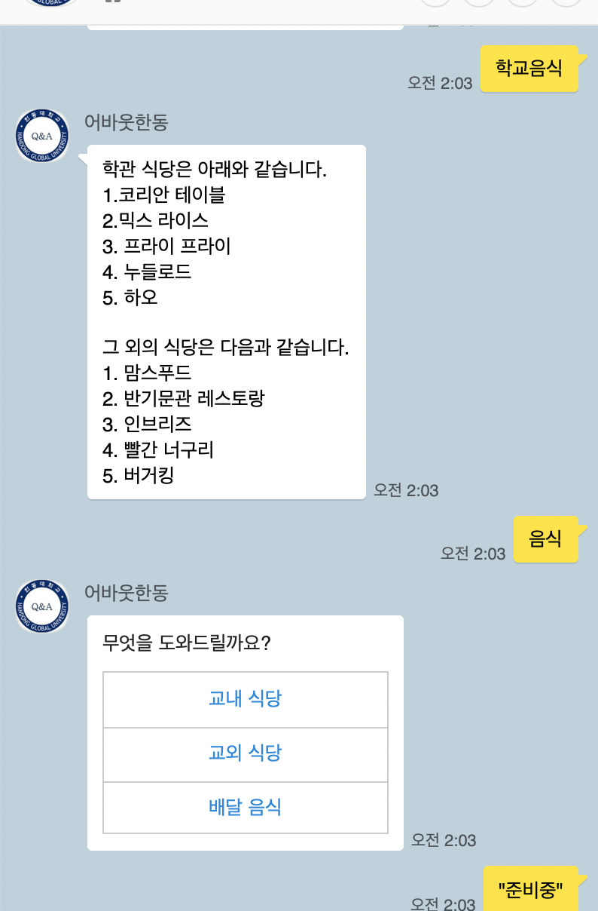
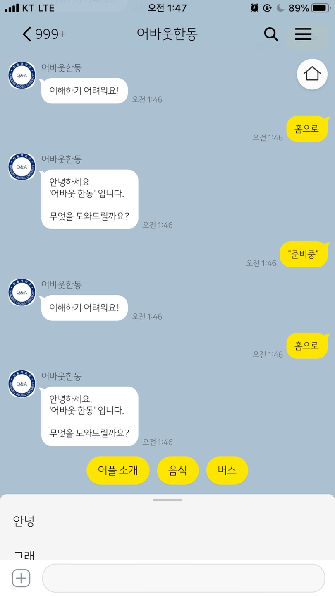

# About-Handong
(About-Handong App and KakaoChatbot project for HGU students )

### Schedule

#### 27.11.2019
-Edit the sentences as replies

 

#### 01.12.2019
-I applied Kakao-I-Builder and then, they approved me to implement my project.

(So finally, I could use machine-learning functions and API there)

-The bleow image is my chatbot version 1.0

(Can do 'food' and 'bus' function a little)

 

.png ) 

 

.png ) 
